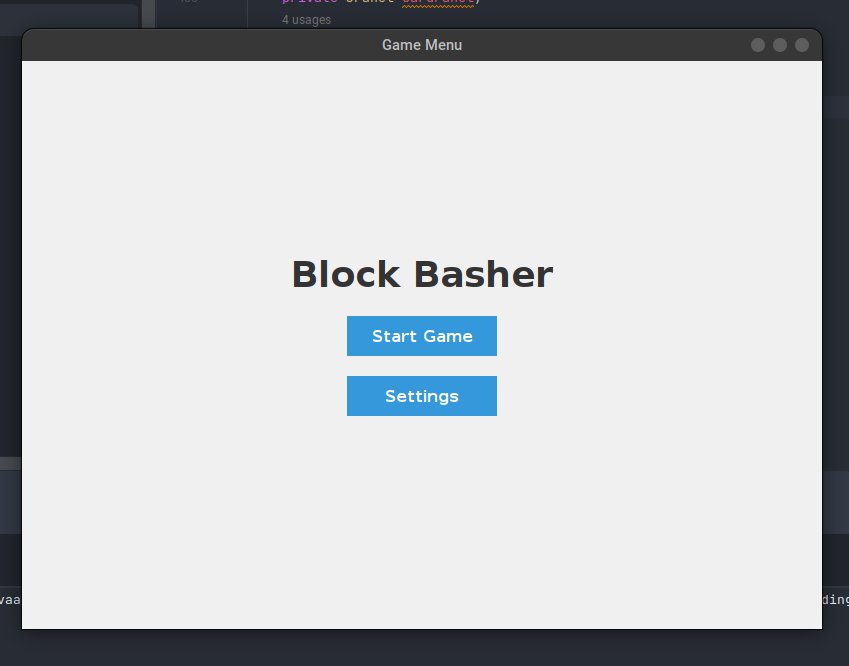
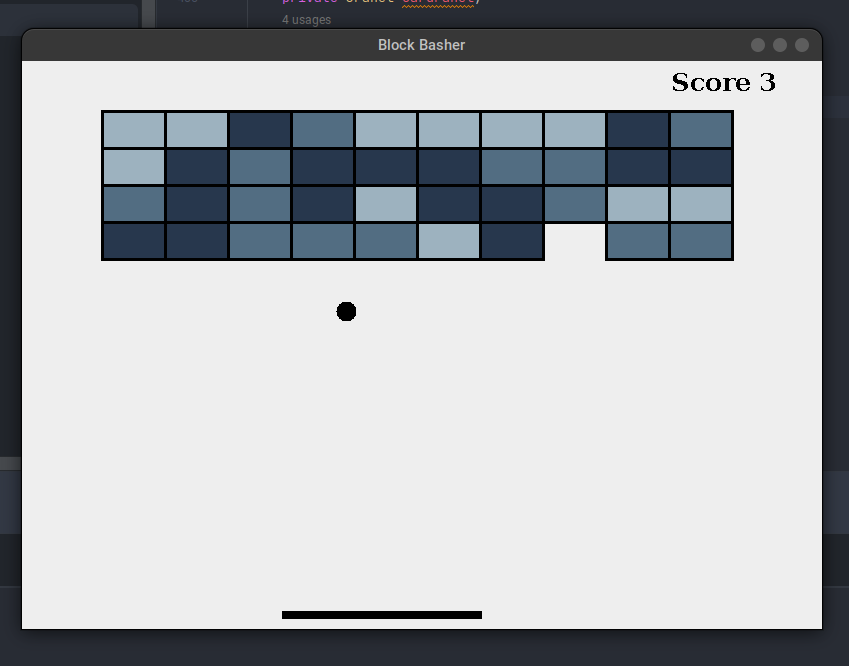
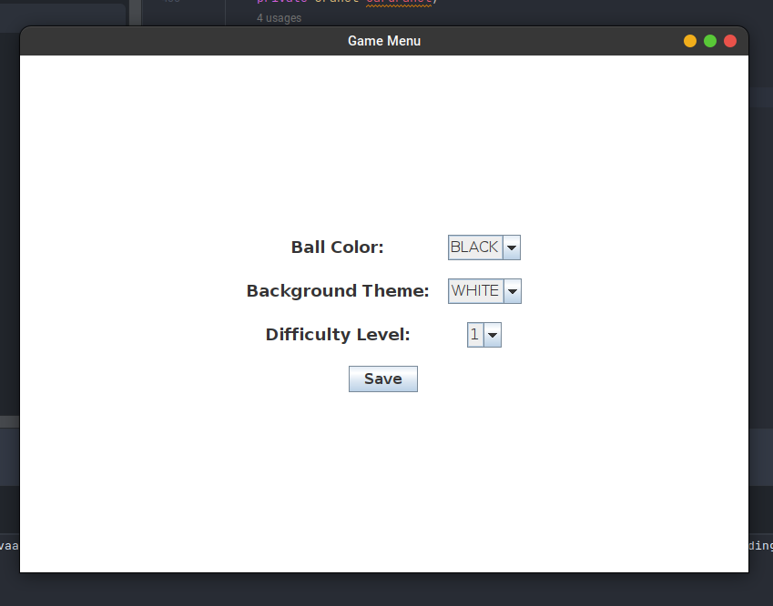

# Block-Basher Game

Welcome to Block-Basher, a classic game where you control a paddle to bounce a ball and destroy bricks!

## Description

Block-Basher represents a classic gaming experience with a player-controlled paddle, a ball, and a structure of breakable objects. Players maneuver the paddle to bounce the ball upwards, aiming to destroy an arrangement of various objects at the top.

### Key Features

- *Object Destruction:* Break objects using a ball bounced off a paddle.
- *Paddle Control:* Maneuver the paddle horizontally to prevent the ball from falling and direct it towards objects.
- *Multiple Levels:* Enjoy multiple levels with different object arrangements and increasing difficulty.
- *Block Variation:* Encounter blocks with varying durability and effects upon destruction.
- *Progression and Challenges:* As you advance, the game becomes faster and more challenging.

## Classes

### MenuFrame

Manages the game menu and settings panels.

### SettingsPanel

Handles game customization and difficulty settings.

### GameFrame

Initializes the game window and hosts the game engine.

### GameEngine

Manages game components including paddle, ball, bricks, scoring, and collision detection.

### BrickManager

Creates and manages the arrangement of bricks in the game.

### PaddleController

Controls the movement and display of the paddle.

### BallController

Manages ball movement, collision detection, and display.

### ScoringSystem & ScoreConnector

Handle game scoring and display the current score.

### CustomizationManager & DifficultyManager

Manage game customization options and difficulty levels.

## Testing Report

The game's various components have undergone rigorous testing to ensure functionality and reliability. 

### Test Cases

1. *Brick Manager:* Checked whether all bricks are hit or intact.
2. *Collision Detection:* Tested collisions between ball-paddle, ball-bricks, and ball-walls.
3. *Defeat Conditions:* Verified game defeat conditions when the ball hits the bottom wall.

## Snapshots of the Game

## How to Use

1. *Clone the Repository:* git clone <https://github.com/Nebular-Nexus/Block-Basher.git>
2. *Compile and Run:* Go to MenuFrame class and press the run option on IntelliJ.
3. *Navigate Menus:* Use arrow keys and Enter to navigate menus.
4. *Start Game:* Hit 'Start' to begin playing the game.

## Contributors

- Srinivasan M
- P Ram Sai Koushik
- Aditya Nagaraja
- Neelapati Rishi

## Acknowledgments

Special thanks to all contributors and testers for their valuable input and effort in developing this Block-Basher game.
